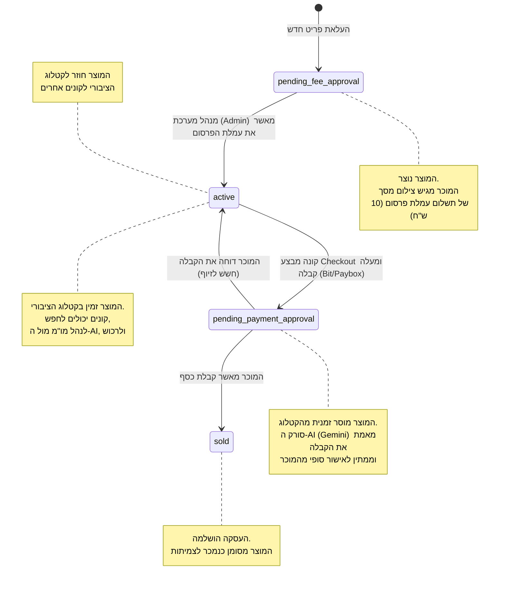
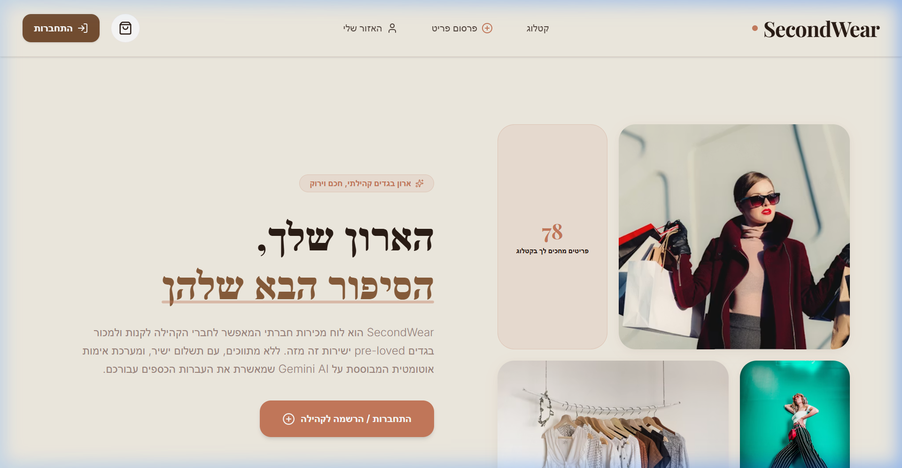
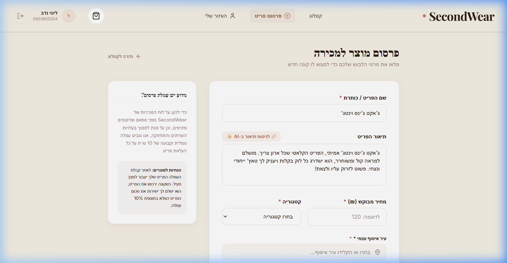

# SecondWear - פלטפורמת אופנה יד שנייה חכמה (Peer-to-Peer)

### 👤 פרטי מגיש הפרויקט:
* **שם מלא:** לינוי נדב
* **תעודת זהות:** [הזינו כאן תעודת זהות]

---

SecondWear היא פלטפורמת מסחר קהילתית (עמית-לעמית) לקנייה ומכירה של בגדי יד שנייה בישראל, המשלבת טכנולוגיות בינה מלאכותית (AI) מתקדמות ואינטגרציות ממשלתיות כדי לייעל, לאבטח ולהפוך את חוויית הרכישה והמכירה למאובטחת, מהירה ואינטראקטיבית.

---

## 📖 סקירה כללית

הפרויקט מאפשר למשתמשים לפתוח חנות אישית, להעלות פריטי לבוש למכירה, לדפדף בקטלוג מסונן, ולהזמין פריטים דרך סל קניות. האתר מבוסס על שירותי ענן של Supabase ומשלב אינטגרציות חכמות:
1. **סורק קבלות חכם (Gemini Vision OCR)**: מאמת באופן אוטומטי ובזמן אמת את צילומי מסך העברות הכספים (Bit / Paybox) כדי למנוע הונאות וקבלות מזויפות.
2. **צ'אט משא ומתן מבוסס AI**: מאפשר לקונה לשוחח עם סימולציה של המוכר בעברית טבעית (Gemini 2.5 Flash), לשאול על מצב הבגד, לקבל המלצות סטיילינג, להתמקח על המחיר ולקבל הנחות מאושרות דינמית.
3. **השלמה אוטומטית של יישובים**: חיבור בזמן אמת ל-API הממשלתי הפתוח לאיתור ואיסוף נוח של הפריט.

---

## 🎯 הגדרת הבעיה והערך

### איזו בעיה הפרויקט פותר (הכאב הקונקרטי)
* **חוסר אמון בעסקאות יד שנייה ישירות**: קונים ומוכרים נאלצים להמתין לאישורי העברות (כמו ביט או פייבוקס), וישנו חשש מתמיד מקבלות מזויפות, צילומי מסך ערוכים או אי-הבנות פיננסיות.
* **סירבול ותשישות במשא ומתן**: תהליך בירור המידות, המצב של הבגד והתמקחות על המחיר מול מוכרים לוקח שעות או ימים של הודעות באפליקציות צ'אט, מה שמוביל לנטישת עסקאות.
* **בזבוז וזיהום סביבתי**: תעשיית האופנה המהירה (Fast Fashion) מייצרת כמויות אדירות של זיהום ובגדים שנזרקים לאחר שימוש קצר. SecondWear מעודדת אופנה מעגלית (Slow Fashion) ונגישה.

---

## 👥 קהל היעד

* **קונים בעלי מודעות סביבתית ואקולוגית**: המחפשים לצרוך בגדים באיכות גבוהה ללא יצירת פסולת חדשה.
* **צעירים, סטודנטים וחובבי אופנה**: המחפשים מותגי פרימיום ומותגי רחוב במחירים נוחים ונגישים.
* **מוכרים המעוניינים לפנות מקום בארון**: שרוצים לייצר הכנסה צדדית מבגדים שאינם בשימוש, ללא המאמץ של מענה מתמיד להודעות והתמקחויות.
* **תרחיש שימוש טיפוסי**: משתמש/ת שרוצה למכור ג'ינס או שמלה שלא לבשה מעולם, מעלה את הפריט ב-2 דקות, משלם/ת עמלת פרסום באשראי סימולטיבי, ומאפשר/ת ל-AI לנהל את השיח מול הקונים 24/7 עד לסגירת העסקה.

---

## ⚖️ מתחרים ובידול בשוק

| מאפיין | יד2 (Yad2) / פייסבוק Marketplace | קבוצות וואטסאפ / טלגרם | SecondWear |
| :--- | :--- | :--- | :--- |
| **חווית קנייה** | לוחות מודעות מיושנים ולא ממוקדים באופנה | שיח לא מסודר, ללא קטלוג מסונן או חיפוש נוח | אתר אי-קומרס מודרני, פרימיום וממוקד אופנה |
| **אימות תשלום** | ידני לחלוטין (חשוף להונאות קבלות) | ידני ללא פיקוח | **סורק AI (Gemini)** הבודק את צילום הקבלה אוטומטית |
| **משא ומתן ובירורים** | הודעות ארוכות ומייגעות, תלוי בזמינות המוכר | תלוי בזמינות ובמענה ידני | **צ'אט סימולציה מבוסס AI** שעונה בשם המוכר 24/7 ומנהל מו"מ |
| **איתור ומיקום** | הזנה ידנית חופשית (טעויות כתיב) | ללא שדות מובנים | **חיבור ל-API הממשלתי (Gov Data)** להשלמת עיר מדויקת |

---

## 📊 ארכיטקטורת נתונים ותרשים ERD (Supabase / Postgres)

מודל הנתונים של **SecondWear** מנוהל במערכת Postgres המאובטחת בענן של Supabase. המודל תוכנן בקפידה כדי לתמוך בארכיטקטורת Peer-to-Peer, אבטחת נתונים מחמירה (RLS), וניהול מחזור חיים מורכב של מוצר.

---

### 1. תרשים ישויות-קשרים (ERD Diagram)

התרשים הבא מציג את מבנה הישויות בבסיס הנתונים ואת הקשרים הלוגיים ביניהן:

```mermaid
erDiagram
    users {
        uuid id PK "DEFAULT gen_random_uuid()"
        string email UNIQUE "NOT NULL"
        string full_name "NOT NULL"
        string phone "NOT NULL (עבור תשלום ישיר)"
        string avatar_url "NULL"
        boolean is_admin "DEFAULT FALSE"
        timestamp created_at "DEFAULT timezone('utc')"
    }

    categories {
        uuid id PK "DEFAULT gen_random_uuid()"
        string name UNIQUE "NOT NULL"
        string icon_url "NULL (שם אייקון מ-Lucide)"
        timestamp created_at "DEFAULT timezone('utc')"
    }

    products {
        uuid id PK "DEFAULT gen_random_uuid()"
        string title "NOT NULL"
        text description "NULL"
        decimal price "NOT NULL (price >= 0)"
        string image_url "NOT NULL"
        uuid category_id FK "REFERENCES categories(id) ON DELETE SET NULL"
        uuid user_id FK "REFERENCES users(id) ON DELETE CASCADE"
        uuid buyer_id FK "REFERENCES users(id) ON DELETE SET NULL"
        string status "DEFAULT 'pending_fee_approval'"
        string fee_proof_url "NULL"
        string payment_proof_url "NULL"
        string payment_method "NULL ('bit' | 'paybox')"
        timestamp created_at "DEFAULT timezone('utc')"
    }

    users ||--o{ products : "מפרסם/ת (user_id)"
    users ||--o{ products : "רוכש/ת (buyer_id)"
    categories ||--o{ products : "מסווג (category_id)"
```

---

### 2. תיאור מפורט של הטבלאות ומודל הנתונים

#### 👤 טבלת משתמשים (`users`)
טבלה המכילה פרופילים ציבוריים של המשתמשים. היא מסונכרנת אוטומטית מטבלת המשתמשים המאובטחת של Supabase Auth.
* **מנגנון סנכרון (Database Trigger):** מוגדר טריגר `on_auth_user_created` המפעיל פונקציית PL/pgSQL בשם `handle_new_user()` מיד לאחר הרשמה מוצלחת של משתמש חדש ב-Supabase Auth, ומעתיק את פרטי המשתמש לטבלה הציבורית.
* **עמודות מפתח:**
  - `id` (UUID, PK) - תואם ל-`id` במערכת האימות.
  - `phone` (Text, Required) - משמש ליצירת קשר מהיר וליצירת קישורי תשלום Peer-to-Peer.
  - `is_admin` (Boolean) - מגדיר הרשאות ניהול (למשל לאישור קבלות וניהול האתר).

#### 🏷️ טבלת קטגוריות (`categories`)
סיווגי הלבוש והאופנה הזמינים בפלטפורמה (למשל: שמלות, חולצות, מכנסיים, נעליים).
* **עמודות מפתח:**
  - `name` (Text, Unique) - שם הקטגוריה.
  - `icon_url` (Text) - שם האייקון מתוך ספריית `lucide-react` לרינדור דינמי ויוקרתי בקליינט.

#### 👕 טבלת מוצרים ופריטים (`products`)
לב המערכת, המכילה את כל פריטי הלבוש למכירה, מנהלת את תהליך הרכישה P2P ואת מצבם הנוכחי.
* **שלמות נתונים והתנהגות מחיקה (Cascading Rules):**
  - `user_id` (FK ל-`users` עם `ON DELETE CASCADE`): אם משתמש מוחק את חשבונו, כל הפריטים שהעלה נמחקים אוטומטית.
  - `buyer_id` (FK ל-`users` עם `ON DELETE SET NULL`): אם קונה מוחק את חשבונו, המוצרים שקנה נשארים במערכת לצרכי תיעוד, אך השדה משתנה ל-`NULL`.
  - `category_id` (FK ל-`categories` עם `ON DELETE SET NULL`): אם קטגוריה נמחקת, הפריטים משויכים לקטגוריית ברירת מחדל או נותרים ללא שיוך כדי לא לפגוע במוצר עצמו.

---

### 3. דיאגרמת מצבים: מחזור חיים של מוצר (Product State Machine)

ניהול המצבים של המוצר הוא קריטי לאבטחת העסקאות ומניעת הונאות. להלן תיאור המצבים ומעברי המצבים (Transitions) המתרחשים בפלטפורמה:



---

### 4. מדיניות אבטחת נתונים ברמת שורה (Row Level Security - RLS)

כדי למנוע מניפולציות וגישה לא מורשית, הפעלנו **Row Level Security** על כל הטבלאות ב-Postgres, עם המדיניות (Policies) הבאות:

* **פרופילי משתמשים (`users`):**
  - **SELECT:** פתוח לכולם (פרופילים ציבוריים של מוכרים צריכים להיות מוצגים לקונים).
  - **INSERT / UPDATE:** מורשה אך ורק למשתמש המחובר עצמו באמצעות השוואת `auth.uid() = id`.
* **קטגוריות (`categories`):**
  - **SELECT:** פתוח לכל משתמשי האתר (אורחים ורשומים).
  - **INSERT / UPDATE / DELETE:** מוגבל למנהלי מערכת (`is_admin = true`) בלבד.
* **מוצרים (`products`):**
  - **SELECT:**
    - משתמשים אורחים ורשומים יכולים לראות רק מוצרים במצב `active`.
    - המוכר (המוסיף) או הקונה (הרוכש) יכולים לראות את הפריט בכל שלב במחזור החיים.
    - מנהלי מערכת (Admins) יכולים לצפות בכל המוצרים במערכת לצורך ניהול ואישור קבלות.
  - **INSERT:** מורשה לכל משתמש מחובר (`auth.role() = 'authenticated'`).
  - **UPDATE:**
    - מוכר יכול לעדכן את הפריט שלו בלבד (`auth.uid() = user_id`).
    - קונה מורשה לעדכן את הפריט בזמן תהליך הרכישה (על מנת להזין את ה-`buyer_id` ואת ה-`payment_proof_url` שלו).
    - מנהל מערכת יכול לעדכן כל פריט (כדי לשנות סטטוס ל-`active` או לנהל תוכן).
  - **DELETE:** מורשה רק למוכר שהעלה את הפריט או למנהל מערכת.

---

## 🔌 רשימת שירותים חיצוניים ואינטגרציות

להלן פירוט השירותים החיצוניים שהמוצר נשען עליהם כדי לספק את חוויית המשתמש:

| שם השירות | סוג | תפקיד במוצר |
| :--- | :--- | :--- |
| **Supabase Database** | בסיס נתונים (Postgres) | שמירה ואחזור של כל המידע המרכזי באתר (פריטים, קטגוריות, משתמשים) בזמן אמת. |
| **Supabase Authentication** | אבטחה ואוטנטיקציה | ניהול הרשמה והתחברות משתמשים מאובטחת, איפוס סיסמאות, והחלת חוקי אבטחה ברמת שורה (RLS Policies). |
| **Google Gemini 2.5 Flash API** | בינה מלאכותית (AI) | 1. **ניתוח קבלות (OCR וויז'ואל)**: סריקה וניתוח אוטומטי של קובצי התמונה של העברות ביט/פייבוקס ומניעת הונאות.<br>2. **סוכן צ'אט המוכר**: סוכן דיאלוגי המדמה את המוכר בעברית טבעית לצורך בירורים ומשא ומתן.<br>3. **מחולל תיאורי מוצר**: מנתח כותרות ותמונות לבוש ומנסח תיאור שיווקי מושך אוטומטית. |
| **Gov Data API (מדינת ישראל)** | מאגרי מידע ממשלתיים | קריאת API פתוחה לשליפת רשימת הערים והיישובים הרשמית של ישראל לצורך השלמה אוטומטית (Autocomplete) בעת העלאת פריט ובעת מילוי פרטי משלוח. |
| **WhatsApp Business Web API** | אינטגרציה חיצונית | יצירת קישור שיחה מהיר (`wa.me`) עם הודעה מובנית מראש המכילה את פרטי הפריט, למעבר מהיר מהצ'אט הווירטואלי לשיחה ישירה מול המוכר. |

---

## 📸 צילומי מסך מהמוצר (Screenshots)

### 1. עמוד הנחיתה הראשי והיוקרתי של האתר (מצב אורח):


### 2. עוזר כתיבת תיאור מוצר ב-AI (מחולל Gemini מבוסס תמונות):


---

## 🔑 פרטי התחברות ונתוני דמו לבדיקה (Demo Credentials)

לצורך בדיקת זרימת המשתמש המלאה (כולל צ׳קאאוט, אימות Gemini AI של קבלות, פרסום פריטים, צ׳אט ואיזור אישי), מוגדרים המשתמשים הבאים בבסיס הנתונים (seeded data):

* **כתובת אימייל להתחברות:** `michal.cohen@gmail.com`
* **סיסמה:** `Secondwear2024!`

*(ניתן להתחבר גם עם משתמשים נוספים המפורטים בקובץ [seed_data.sql](file:///c:/Users/linoy/Desktop/secondwear1/seed_data.sql) עם אותה סיסמה)*

---

## 🛠️ הוראות הרצה מקומיות וקישורים

### 🔗 קישור לפרויקט החי (Live Deployment)
הפרויקט פרוס ועובד בכתובת: **[secondwear1.vercel.app](https://secondwear1.vercel.app)**

---

### 💻 הרצה מקומית במחשב

#### 1. דרישות קדם
* מותקן Node.js (גרסה 18 ומעלה)

#### 2. התקנה
שכפלו את הריפו והתקינו את התלויות:
```bash
git clone https://github.com/linoynadav2004-web/secondwear1-.git
cd secondwear1-
npm install
```

#### 3. משתני סביבה
צרו קובץ `.env` בתיקייה הראשית והוסיפו את המשתנים הבאים עם המפתחות שלכם:
```env
VITE_SUPABASE_URL=YOUR_SUPABASE_URL
VITE_SUPABASE_ANON_KEY=YOUR_SUPABASE_ANON_KEY
VITE_GEMINI_API_KEY=YOUR_GEMINI_API_KEY
```

#### 4. הרצה במצב פיתוח
```bash
npm run dev
```
האתר יהיה זמין במחשב בכתובת: `http://localhost:5173`.
